<!--
  GitHub profile README for Thejoshuajose.
  Owner: FIWB Solutions LLC · Author: Joshua Gonzales.
  Setup, placeholders and maintenance: docs/SETUP.md
-->

  

  <b>Full-stack developer building production web applications, APIs, mobile apps, and the cloud infrastructure they run on.</b>

  

  
  
  

 

I'm Josh. I build software at **FIWB Solutions LLC** and take products from the first requirement to production: the interface, the API, the data model, the deployment, and the support after launch. Most of that work is private software running real businesses.

- **Full-stack products:** React and TypeScript front ends on top of APIs and databases I design myself
- **APIs and backend systems:** REST services in FastAPI and ASP.NET Core with JWT and passkey authentication
- **Cloud infrastructure:** AWS Elastic Beanstalk, Secrets Manager, DNS, TLS and CI/CD with GitHub Actions
- **Business software:** web, mobile and desktop tools that run day-to-day operations for real companies

## Development activity

<picture>
  <source media="(prefers-color-scheme: dark)" srcset="https://raw.githubusercontent.com/Thejoshuajose/Thejoshuajose/stats/activity-dark.svg" />
  <source media="(prefers-color-scheme: light)" srcset="https://raw.githubusercontent.com/Thejoshuajose/Thejoshuajose/stats/activity.svg" />
  
</picture>

<picture>
  <source media="(prefers-color-scheme: dark)" srcset="https://raw.githubusercontent.com/Thejoshuajose/Thejoshuajose/stats/languages-dark.svg" />
  <source media="(prefers-color-scheme: light)" srcset="https://raw.githubusercontent.com/Thejoshuajose/Thejoshuajose/stats/languages.svg" />
  
</picture>

<picture>
  <source media="(prefers-color-scheme: dark)" srcset="https://raw.githubusercontent.com/Thejoshuajose/Thejoshuajose/output/github-contribution-grid-snake-dark.svg" />
  <source media="(prefers-color-scheme: light)" srcset="https://raw.githubusercontent.com/Thejoshuajose/Thejoshuajose/output/github-contribution-grid-snake.svg" />
  
</picture>

Cards are generated daily from the GitHub API by this repository's own workflows. They count private work, so the numbers are higher than what the public repositories alone would show.

## Technologies

**Frontend** 

**Backend** 

**Mobile** 

**Desktop** 

**Data** 

**Cloud and DevOps** 

## What I work on

**Full-stack applications**: interfaces, backend services, data models and deployment, designed together.

**API development**: REST APIs, authentication, data services, third-party integrations and the business rules behind them.

**Cloud infrastructure**: AWS deployments, environment configuration and secrets, DNS, SSL/TLS, application hosting and CI/CD.

**Product engineering**: turning a business requirement into software people use every day, then maintaining it.

## Currently building

- Customer portals and admin tools on React and Supabase, for web and native mobile
- Passkey-first authentication across APIs and mobile apps
- Offline desktop tooling in .NET
- Tighter CI, dependency pinning and deployment workflows

## Let's connect

Interested in building something together? I take on full-stack products, APIs and cloud work from first idea to production.

  
  
  

 

Building software from interface to infrastructure.

